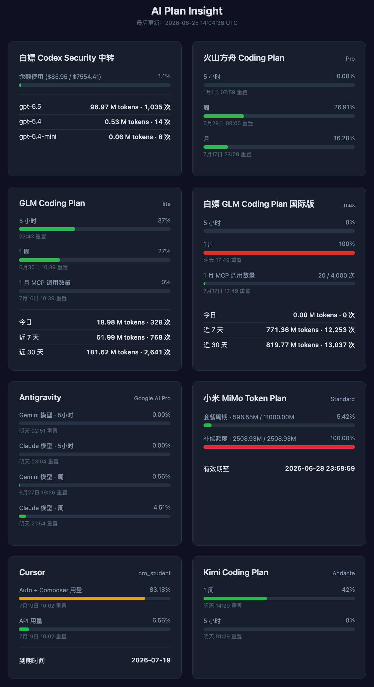

# AI Plan Insight

收集各家 AI Coding Plan 用量的获取方式，聚合查看多个 AI 编码订阅的用量和余额信息。

你可以直接部署本项目作为统一用量面板使用，也可以把本项目拉下来给 Coding Agent 直接参考各家 Plan 的用量获取方式。

支持 CLI 和 Web 两种使用方式。

## 预览



## 用量获取方式一览

| Provider | 获取方式 | 说明 | Agent 项目地址 |
|---|---|---|---|
| Codex 中转 | ✅ 直接获取 | Sub2API，配置 `api_key` + `base_url` | — |
| 火山方舟 Coding Plan | ✅ 直接获取 | 配置 `access_key_id` + `access_key_secret` | — |
| GLM Coding Plan (智谱) | ✅ 直接获取 | 配置 `api_key` | — |
| GLM Coding Plan 国际版 | ✅ 直接获取 | 配置 `api_key` | — |
| Kimi Coding Plan | ✅ 直接获取 | 配置 `api_key` | — |
| 华为云余额 | ✅ 直接获取 | 配置 `access_key_id` + `access_key_secret` | — |
| AIPing | ✅ 直接获取 | 配置 `api_key` | — |
| ZenMux | ✅ 直接获取 | 配置 `api_key`（Management API Key），同时获取订阅配额与 PAYG 余额 | — |
| Cursor | 🤖 需要本地 Agent | 通过 Agent 抓取后推送到面板 | [cursor-usage-agent](https://github.com/FlintyLemming/cursor-usage-agent) |
| MiMo Token Plan | 🤖 需要本地 Agent | 通过 Agent 抓取后推送到面板 | [mimo-usage-agent](https://github.com/FlintyLemming/mimo-usage-agent) |
| Antigravity | 🤖 需要本地 Agent | 使用 [Antigravity Manager](https://github.com/lbjlaq/Antigravity-Manager)，但原项目未实现周用量读取，可参考我的 [PR #3185](https://github.com/lbjlaq/Antigravity-Manager/pull/3185)（尚未合并） | [Antigravity Manager](https://github.com/lbjlaq/Antigravity-Manager) |
| Claude 订阅 | 🤖 需要本地 Agent | 通过 Agent 抓取后推送到面板 | [claude-sub-agent](https://github.com/FlintyLemming/claude-sub-agent) |

## 部署

### 拉取镜像

```bash
docker pull git.mitsea.com/flintylemming/ai-plan-insight:latest
```

### 运行容器

```bash
docker run -d \
  --name ai-plan-insight \
  --log-opt max-size=10m \
  --log-opt max-file=3 \
  -p 8000:8000 \
  -v ~/.ai_plan_insight.json:/root/.ai_plan_insight.json:ro \
  git.mitsea.com/flintylemming/ai-plan-insight:latest \
  python -m ai_plan_insight --web --host 0.0.0.0 --port 8000
```

容器启动后访问 `http://localhost:8000` 查看 Web 界面。

### Docker Compose

参考 [sample-compose.yaml](sample-compose.yaml)，复制为 `compose.yaml` 后按需修改：

```bash
cp sample-compose.yaml compose.yaml
docker compose up -d
```

### 配置文件

在宿主机创建 `~/.ai_plan_insight.json`，按需填写要使用的 Provider：

```json
{
  "providers": {
    "codex": {
      "api_key": "YOUR_CODEX_API_KEY",
      "base_url": "https://api2.ai.aiatechco.com"
    },
    "codex_security": {
      "api_key": "YOUR_CODEX_SECURITY_API_KEY",
      "base_url": "https://tinykittens.online"
    },
    "volcengine_ark": {
      "access_key_id": "YOUR_VOLCENGINE_ACCESS_KEY_ID",
      "access_key_secret": "YOUR_VOLCENGINE_SECRET_ACCESS_KEY"
    },
    "bigmodel": {
      "api_key": "YOUR_BIGMODEL_API_KEY"
    },
    "kimi": {
      "api_key": "YOUR_KIMI_API_KEY"
    },
    "huawei_cloud": {
      "user_name": "YOUR_HUAWEI_CLOUD_USER_NAME",
      "access_key_id": "YOUR_HUAWEI_CLOUD_ACCESS_KEY_ID",
      "access_key_secret": "YOUR_HUAWEI_CLOUD_SECRET_ACCESS_KEY"
    },
    "aiping": {
      "api_key": "YOUR_AIPING_API_KEY"
    },
    "zenmux": {
      "api_key": "YOUR_ZENMUX_MANAGEMENT_API_KEY"
    }
  }
}
```

不需要的 Provider 直接删除即可。

每个 Provider 还支持可选的 `order` 字段，用于控制卡片在面板中的显示顺序：数值越小越靠前，未填写时默认 `999`（排到最后）。推送类服务（`cursor` / `claude` / `mimo_token_plan`）也可以在 `providers` 里加一条只含 `order` 的占位项来指定它们的位置。

```json
{
  "providers": {
    "claude": { "order": 12 },
    "bigmodel": { "api_key": "YOUR_BIGMODEL_API_KEY", "order": 20 },
    "kimi": { "api_key": "YOUR_KIMI_API_KEY", "order": 30 }
  }
}
```

## CLI 使用

```bash
# 本地运行，需要先安装依赖
pip install .
ai-plan-insight

# 指定配置文件
ai-plan-insight --config /path/to/config.json
```

## API

Web 模式下提供以下接口：

- `GET /api/usage` — 返回所有 Provider 的用量数据
- `GET /api/status` — 返回最近一次刷新时间
- `POST /api/push/cursor` — 接收 Cursor 的用量推送
- `POST /api/push/mimo` — 接收 MiMo 的用量推送
- `POST /api/push/antigravity` — 接收 Antigravity 的用量推送
- `POST /api/push/claude` — 接收 Claude 订阅的用量推送

后台数据每 30 秒自动刷新。若某个 Provider 连续 3 次取数据失败，才会从页面消失。

对于通过 Push API 推送数据的 Provider（Cursor、MiMo、Antigravity、Claude），数据保留 30 分钟。若 30 分钟内未收到新的推送，对应区块将从页面消失，直到再次推送。

### 用量推送 (Push API)

对于无法直接配置 API 密钥拉取的服务（如 Cursor、MiMo、Antigravity），可以通过 Push API 将用量数据主动推送给面板。

#### 推送 Cursor 用量

传入 `membership`、`autoPercentUsed`、`apiPercentUsed` 和 `billingEnd`。

```bash
curl -X POST http://localhost:8000/api/push/cursor \
  -H "Content-Type: application/json" \
  -d '{
    "membership": "Pro",
    "autoPercentUsed": 45.5,
    "apiPercentUsed": 12.3,
    "billingEnd": "2026-07-01T00:00:00Z"
  }'
```

#### 推送 MiMo 用量

```bash
curl -X POST http://localhost:8000/api/push/mimo \
  -H "Content-Type: application/json" \
  -d '{
    "provider": "小米 MiMo Token Plan",
    "user_id": "your_user_id",
    "membership_level": "Premium",
    "limits": [],
    "balances": {}
  }'
```

#### 推送 Antigravity 用量

分别传入 `gemini_3_1_pro`、`gemini_3_flash` 以及 `claude_series` 三款模型证书的 5 小时用量百分比 (`_percentage`) 和重置时间 (`_reset_time`，ISO8601 字符串)。

```bash
curl -X POST http://localhost:8000/api/push/antigravity \
  -H "Content-Type: application/json" \
  -d '{
    "gemini_3_1_pro_percentage": 5.0,
    "gemini_3_1_pro_reset_time": "2026-04-15T00:00:00Z",
    "gemini_3_flash_percentage": 0.5,
    "gemini_3_flash_reset_time": "2026-04-15T00:00:00Z",
    "claude_series_percentage": 90.5,
    "claude_series_reset_time": "2026-04-15T00:00:00Z"
  }'
```

#### 推送 Claude 订阅用量

分别传入 `seven_day` 与 `five_hour` 的用量百分比 (`utilization`) 和重置时间 (`resets_at`，ISO8601 字符串)。

```bash
curl -X POST http://localhost:8000/api/push/claude \
  -H "Content-Type: application/json" \
  -d '{
    "seven_day": {
      "utilization": 45.2,
      "resets_at": "2026-07-08T12:00:00Z"
    },
    "five_hour": {
      "utilization": 12.8,
      "resets_at": "2026-07-01T15:00:00Z"
    }
  }'
```
