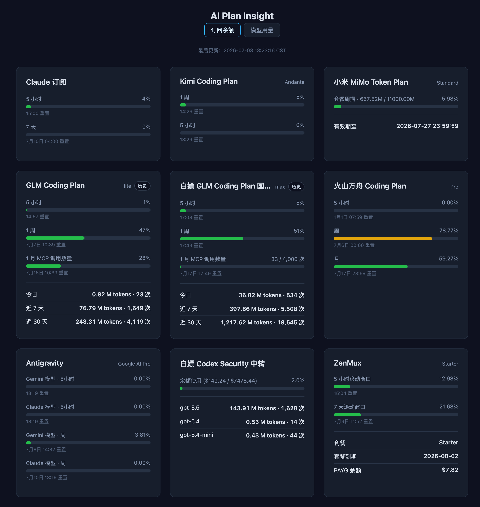
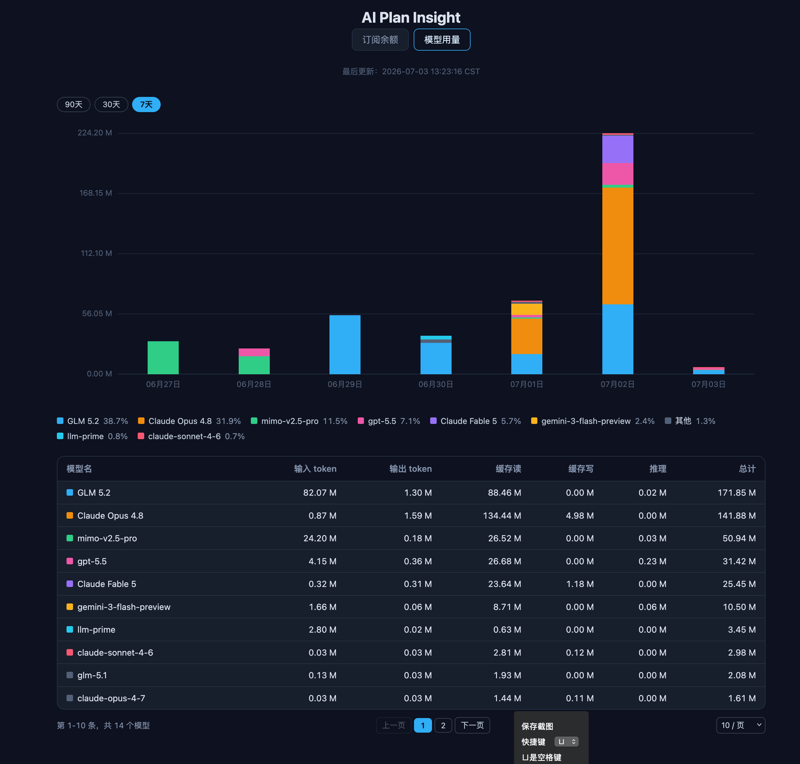

# AI Plan Insight

收集各家 AI Coding Plan 用量的获取方式，聚合查看多个 AI 编码订阅的用量和余额信息。

你可以直接部署本项目作为统一用量面板使用，也可以把本项目拉下来给 Coding Agent 直接参考各家 Plan 的用量获取方式。

## 预览

### 订阅用量总览

以卡片形式聚合展示各 AI Coding Plan 的用量、余额和刷新时间，底部附带 30 天用量趋势图。



### 总模型用量

按供应商汇总各模型的 Token 消耗明细，支持分页浏览历史记录。



## 支持的服务一览

订阅余额通过「Provider 实例」机制获取。每个实例对应一张卡片，同一服务类型可以配置多个实例（例如两个 Claude 账号各一张卡片）。每个实例的采集模式为 `fetch`（面板主动拉取）或 `push`（本地 Agent 推送）二选一。

| 服务 | `type` | 模式 | 凭据 / 说明 | Agent 项目地址 |
|---|---|---|---|---|
| Codex 中转 | `codex` | fetch | Sub2API，配置 `api_key` + `base_url` | — |
| Codex Sub2API 中转 | `codex_sub2api` | fetch | 配置 `api_key` + `base_url` | — |
| 火山方舟 Coding Plan | `volcengine_ark` | fetch | 配置 `access_key_id` + `access_key_secret` | — |
| GLM Coding Plan (智谱) | `bigmodel` | fetch | 配置 `api_key`，支持历史用量视图 | — |
| GLM Coding Plan 国际版 | `bigmodel_international` | fetch | 配置 `api_key` | — |
| Kimi Coding Plan | `kimi` | fetch | 配置 `api_key` | — |
| 华为云余额 | `huawei_cloud` | fetch | 配置 `user_name` + `access_key_id` + `access_key_secret` | — |
| AIPing | `aiping` | fetch | 配置 `api_key` | — |
| ZenMux | `zenmux` | fetch | 配置 `api_key`（Management API Key），同时获取订阅配额与 PAYG 余额 | — |
| Antigravity | `antigravity` | fetch / push | fetch 模式经 [Antigravity Manager](https://github.com/lbjlaq/Antigravity-Manager) 的 API 获取（`api_key` + `base_url`，可选 `admin_password`）；也可用 push 模式由 Agent 推送。原项目未实现周用量读取，可参考我的 [PR #3185](https://github.com/lbjlaq/Antigravity-Manager/pull/3185)（尚未合并） | [Antigravity Manager](https://github.com/lbjlaq/Antigravity-Manager) |
| Cursor | `cursor` | push | 通过 Agent 抓取后推送到面板 | [cursor-usage-agent](https://github.com/FlintyLemming/cursor-usage-agent) |
| Claude 订阅 | `claude` | push | 通过 Agent 抓取后推送到面板 | [claude-sub-agent](https://github.com/FlintyLemming/claude-sub-agent) |
| Grok 订阅 | `grok` | push | 通过 Agent 抓取月/周配额后推送到面板 | — |
| MiMo Token Plan | `mimo_token_plan` | push | 通过 Agent 抓取后推送到面板 | [mimo-usage-agent](https://github.com/FlintyLemming/mimo-usage-agent) |

此外，「总模型用量」表格的数据独立于订阅余额系统，通过 `POST /api/usage/report` 接收各模型的 Token 消耗明细，可使用 [ai-usage-agent](https://github.com/FlintyLemming/ai-usage-agent) 自动抓取并推送。

## 部署

### 拉取镜像

```bash
docker pull git.mitsea.com/flintylemming/ai-plan-insight:latest
```

### 运行容器

准备一个配置目录（如 `~/ai-plan-insight`），放入下文的配置文件 `config.json`，然后挂载到容器：

```bash
docker run -d \
  --name ai-plan-insight \
  --log-opt max-size=10m \
  --log-opt max-file=3 \
  -p 8000:8000 \
  -v ~/ai-plan-insight:/data \
  git.mitsea.com/flintylemming/ai-plan-insight:latest \
  python -m ai_plan_insight --web --host 0.0.0.0 --port 8000 --config /data/config.json
```

容器启动后访问 `http://localhost:8000` 查看 Web 界面。

SQLite 数据库 `usage.db` 默认生成在配置文件同目录（即 `/data/usage.db`），保存模型用量历史和卡片快照，挂载目录后重启容器不会丢数据。

### Docker Compose

参考 [sample-compose.yaml](sample-compose.yaml)，复制为 `compose.yaml` 后按需修改：

```bash
cp sample-compose.yaml compose.yaml
docker compose up -d
```

### 命令行参数

| 参数 | 说明 |
|---|---|
| `--web` | 以 Web 服务方式运行（默认且唯一模式） |
| `--host` | 监听地址，默认 `127.0.0.1` |
| `--port` | 监听端口，默认 `8765` |
| `--config` | 配置文件路径（订阅余额实例 + 模型用量 alias + 推送认证） |
| `--usage-db` | SQLite 数据库路径，默认取 `--config` 同目录下的 `usage.db` |

### 配置（config.json）

订阅余额与模型用量共用唯一配置文件 `config.json`（参考 [config.json.example](config.json.example)）。顶层 `providers` 是订阅余额的实例注册表：key 为实例 ID，值为该实例的类型、模式、标签和凭据；`model_aliases` 是「总模型用量」的模型名别名；`push_auth_secret` / `enforce_push_auth` 是两套推送接口共用的推送认证（见下文「推送认证」）。

```json
{
  "providers": {
    "claude-personal": {
      "type": "claude",
      "mode": "push",
      "label": "个人号",
      "order": 12
    },
    "claude-work": {
      "type": "claude",
      "mode": "push",
      "label": "工作号",
      "order": 13
    },
    "bigmodel-personal": {
      "type": "bigmodel",
      "mode": "fetch",
      "label": "个人账号",
      "api_key": "YOUR_BIGMODEL_API_KEY",
      "order": 20
    },
    "kimi-main": {
      "type": "kimi",
      "mode": "fetch",
      "label": "主账号",
      "api_key": "YOUR_KIMI_API_KEY",
      "order": 30
    }
  },
  "model_aliases": {
    "GLM 5.2": ["glm-5.2", "glm5.2"],
    "GPT 5.2": ["gpt-5.2"],
    "Claude Sonnet 4.5": ["claude-sonnet-4-5", "claude-sonnet-4-5-20250929"]
  },
  "push_auth_secret": "your-secret-token",
  "enforce_push_auth": false
}
```

实例字段说明：

| 字段 | 必填 | 说明 |
|---|---|---|
| 配置 key（实例 ID） | ✅ | 实例的稳定唯一标识，需匹配 `[A-Za-z0-9._-]+`；push 实例的推送 URL 会用到它，改名相当于换了一个实例 |
| `type` | ✅ | 服务类型，取值见上方「支持的服务一览」表 |
| `mode` | ✅ | `fetch` 或 `push`，一个实例只能使用一种采集模式 |
| `label` | ✅ | 实例展示标签，卡片标题为 `<服务名> · <label>`，如「Claude 订阅 · 工作号」 |
| `order` | ❌ | 卡片显示顺序，数值越小越靠前，默认 `999`；相同 `order` 按卡片标题稳定排序 |
| 凭据字段 | 按类型 | fetch 实例按类型填写 `api_key`、`base_url`、`access_key_id` 等，见上表；push 实例不需要凭据 |

配置容错加载：顶层结构错误（文件缺失、JSON 解析失败、未知顶层字段）会使整个配置不可用，通过 `GET /api/status/v2` 的 `config_error` 暴露，Web 仍可启动；单实例错误（未知 `type`、非法 `mode`、空 `label`、缺少必填凭据、出现该类型不支持的字段、非法实例 ID）只会跳过该实例并记入 `instance_errors`，其余实例正常加载与显示，余额页上方会提示被忽略的实例数量。修改 `config.json` 后下一次请求即生效，无需重启服务（基于文件修改时间的热重载）。

- `model_aliases`：把不同来源上报的原始模型 ID 归并为同一个展示名，未配置的模型 ID 原样展示。
- `push_auth_secret` / `enforce_push_auth`：`POST /api/push/v2/{instance_id}` 与 `POST /api/usage/report` 共用的推送认证，见下文「推送认证」。

### 从旧版迁移（config.v2.json → config.json）

若你已有 `config.v2.json` 与 `config.json` 两份配置：

1. 将 `config.v2.json` 的 `providers`、`push_auth_secret`、`enforce_push_auth` 合入 `config.json`。
2. 保留 `config.json` 的 `model_aliases`。
3. 统一 `push_auth_secret` 为单一值，并同步给所有 push agent 与 ai-usage-agent。
4. 删除 `config.v2.json`，重启服务（之后修改 `config.json` 无需重启）。

## 数据获取逻辑（订阅余额）

- **fetch 实例**：后台每 30 秒并发刷新所有 fetch 实例。某个实例连续失败时，前两次沿用上一次成功结果，第三次起卡片显示错误信息；单个实例失败不影响其他实例。
- **push 实例**：数据保留 30 分钟。若 30 分钟内未收到新的推送，对应卡片将从页面消失，直到再次推送。同一类型的多个实例互不覆盖。
- **持久化**：每个实例的最新卡片状态写入 SQLite 快照，重启后自动恢复（push 快照恢复后仍按 30 分钟有效期判断；已从配置中删除的实例不会恢复）。

## API

Web 模式下提供以下接口。

订阅余额：

- `GET /api/usage/v2` — 返回所有实例的卡片数据；未配置或配置无效时返回空数组
- `GET /api/status/v2` — 返回 `enabled`（是否启用）、`last_updated`（最近刷新时间）、`config_error`（顶层配置错误信息）、`instance_errors`（被跳过实例的错误映射，含未知 `type`，余额页上方会提示有几个实例被忽略）
- `POST /api/push/v2/{instance_id}` — 接收 push 实例的用量推送

模型 Token 用量：

- `POST /api/usage/report` — 接收各模型的 Token 消耗明细
- `GET /api/usage/timeseries?days=30` — 返回用量趋势数据，`days` 支持 7 / 30 / 90
- `GET /api/sources/stale` — 列出超过 24 小时未上报的推送来源（Agent 存活告警）
- `POST /api/sources/{source_id}/dismiss-stale` — 关闭某个来源的告警，直到它再次上报
- `GET /api/admin/sources` — 返回各推送来源的认证状态

## 用量推送 (Push API)

对于 `mode` 为 `push` 的实例，由本地 Agent 将用量数据推送到：

```text
POST /api/push/v2/{instance_id}
Authorization: Bearer <push_auth_secret>
Content-Type: application/json
```

`instance_id` 即 `config.json` 的 `providers` 中的配置 key，必须预先声明；请求 body 按实例的 `type` 使用对应的 payload 格式。错误响应：

| 状态码 | 含义 |
|---|---|
| `503` | 订阅余额配置不存在或无效 |
| `404` | `instance_id` 未在配置中声明 |
| `422` | 目标实例是 fetch 实例，或 body 不符合该类型的格式 |
| `401` | 已启用 `enforce_push_auth` 且 token 缺失或错误 |

以下示例中的实例 ID（如 `claude-personal`）请替换为自己配置中的实际 key。

### 推送 Claude 订阅用量（type: claude）

分别传入 `seven_day` 与 `five_hour` 的用量百分比 (`utilization`) 和重置时间 (`resets_at`，ISO8601 字符串)。

```bash
curl -X POST http://localhost:8000/api/push/v2/claude-personal \
  -H "Authorization: Bearer your-secret-token" \
  -H "Content-Type: application/json" \
  -d '{
    "seven_day": {
      "utilization": 45.2,
      "resets_at": "2026-07-08T12:00:00Z"
    },
    "five_hour": {
      "utilization": 12.8,
      "resets_at": "2026-07-01T15:00:00Z"
    }
  }'
```

### 推送 Grok 订阅用量（type: grok）

可同时传入月配额与周配额（对齐 Grok CLI / pi-grok-cli）：

- `monthly`：绝对 credits（`used` / `limit` / `resets_at`）
- `weekly`：用量百分比（`utilization` / `resets_at`）
- `plan`：可选订阅档位展示名（如 `SuperGrok`），空白会被忽略

至少需要 `monthly` 或 `weekly` 之一，两者都缺会返回 422。

```bash
curl -X POST http://localhost:8000/api/push/v2/grok-main \
  -H "Authorization: Bearer your-secret-token" \
  -H "Content-Type: application/json" \
  -d '{
    "monthly": {
      "used": 448,
      "limit": 15000,
      "resets_at": "2026-08-01T00:00:00+00:00"
    },
    "weekly": {
      "utilization": 45.2,
      "resets_at": "2026-07-10T04:01:09Z"
    },
    "plan": "SuperGrok"
  }'
```

### 推送 Cursor 用量（type: cursor）

传入 `membership`、`autoPercentUsed`、`apiPercentUsed` 和 `billingEnd`。

```bash
curl -X POST http://localhost:8000/api/push/v2/cursor-main \
  -H "Authorization: Bearer your-secret-token" \
  -H "Content-Type: application/json" \
  -d '{
    "membership": "Pro",
    "autoPercentUsed": 45.5,
    "apiPercentUsed": 12.3,
    "billingEnd": "2026-07-01T00:00:00Z"
  }'
```

### 推送 MiMo 用量（type: mimo_token_plan）

卡片标题以配置中的 `label` 为准，body 中的 `provider` 字段不会覆盖它。

```bash
curl -X POST http://localhost:8000/api/push/v2/mimo-main \
  -H "Authorization: Bearer your-secret-token" \
  -H "Content-Type: application/json" \
  -d '{
    "user_id": "your_user_id",
    "membership_level": "Premium",
    "limits": [],
    "balances": {}
  }'
```

### 推送 Antigravity 用量（type: antigravity）

分别传入 `gemini_3_1_pro`、`gemini_3_flash` 以及 `claude_series` 三款模型证书的 5 小时用量百分比 (`_percentage`) 和重置时间 (`_reset_time`，ISO8601 字符串)。

```bash
curl -X POST http://localhost:8000/api/push/v2/antigravity-main \
  -H "Authorization: Bearer your-secret-token" \
  -H "Content-Type: application/json" \
  -d '{
    "gemini_3_1_pro_percentage": 5.0,
    "gemini_3_1_pro_reset_time": "2026-04-15T00:00:00Z",
    "gemini_3_flash_percentage": 0.5,
    "gemini_3_flash_reset_time": "2026-04-15T00:00:00Z",
    "claude_series_percentage": 90.5,
    "claude_series_reset_time": "2026-04-15T00:00:00Z"
  }'
```

### 推送模型 Token 用量

将各模型的 Token 消耗明细推送到面板，汇总展示在「总模型用量」表格中。可使用 [ai-usage-agent](https://github.com/FlintyLemming/ai-usage-agent) 自动抓取并推送。

```bash
curl -X POST http://localhost:8000/api/usage/report \
  -H "Authorization: Bearer your-secret-token" \
  -H "Content-Type: application/json" \
  -d '{
    "source_id": "my-agent",
    "source_label": "My Agent",
    "reported_at": "2026-07-03",
    "points": [
      {
        "date": "2026-07-03",
        "model_id": "claude-3-5-sonnet",
        "input_tokens": 15000,
        "output_tokens": 8000,
        "cache_read_tokens": 5000,
        "cache_write_tokens": 2000,
        "reasoning_tokens": 1000
      }
    ]
  }'
```

**参数说明：**

| 字段 | 类型 | 必填 | 说明 |
|---|---|---|---|
| `source_id` | string | ✅ | 推送来源标识，用于区分不同 Agent |
| `source_label` | string | ❌ | 推送来源的显示名称 |
| `reported_at` | string (YYYY-MM-DD) | ❌ | Agent 运行日期，该日期之前的数据将被冻结（不可修改） |
| `points` | array | ✅ | Token 用量明细列表 |
| `points[].date` | string (YYYY-MM-DD) | ✅ | 用量日期 |
| `points[].model_id` | string | ✅ | 模型标识符 |
| `points[].input_tokens` | int | ✅ | 输入 Token 数 |
| `points[].output_tokens` | int | ✅ | 输出 Token 数 |
| `points[].cache_read_tokens` | int | ❌ | Cache Read Token 数，默认 0 |
| `points[].cache_write_tokens` | int | ❌ | Cache Write Token 数，默认 0 |
| `points[].reasoning_tokens` | int | ❌ | Reasoning Token 数，默认 0 |

若某个来源超过 24 小时未上报，页面会显示 Agent 存活告警，可通过 `POST /api/sources/{source_id}/dismiss-stale` 手动关闭。

## 推送认证

所有推送接口支持 Bearer Token 认证：

```text
Authorization: Bearer <push_auth_secret>
```

`POST /api/push/v2/{instance_id}` 与 `POST /api/usage/report` 共用 `config.json` 顶层的唯一 `push_auth_secret`，所有 push 实例与模型用量上报使用同一个 token。

`enforce_push_auth` 为 `false`（默认）时，token 缺失或错误的请求仍会被接受，只记录为未认证，便于逐个迁移客户端；全部客户端更新完毕后改为 `true`，未认证请求将返回 `401 Unauthorized`。

对于模型用量上报，可通过 `GET /api/admin/sources` 查看各来源的认证状态；当所有 `auth_valid` 都为 `true` 时即可放心开启 `enforce_push_auth`。
